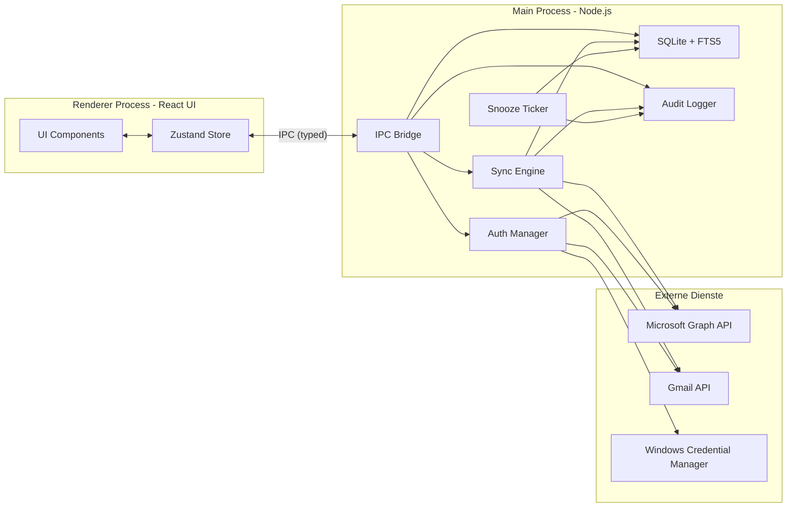

# MailClient - Konzept und Roadmap

## 1. Produkt-Vision und Positionierung

**In einem Satz:**

> Ein schneller, lokaler Mail-Workflow-Client fuer Windows 11 fuer Microsoft-365-Power-User mit mehreren Konten und Gmail, der Mails in klare naechste Aktionen verwandelt - statt sie nur zu verwalten.

**Was der Client NICHT sein will:**

- Kein "noch ein Outlook-Ersatz fuer alle"
- Kein Web-Mailer-Klon
- Kein voller Kalender-Nachbau

**Was der Client sein will:**

- Persoenliches Mail-Command-Center fuer Vielnutzer
- Schneller Multi-Account-Hub mit kontoübergreifender Suche
- Workflow-Tool: jede Mail bekommt eine klare naechste Aktion (Antworten, ToDo, Snoozen, Warten auf, Archivieren, Loeschen)

## 2. Tech-Stack (final)

- **Runtime:** Electron 30+ (Main = Node.js, Renderer = Chromium)
- **Sprache:** TypeScript (strict)
- **UI:** React 18 + Vite + TailwindCSS + shadcn/ui (Radix) + lucide-react Icons
- **State:** Zustand (leichtgewichtig)
- **Lokaler Speicher:** SQLite via `better-sqlite3` + FTS5; spaeter optional SQLCipher
- **Auth-Storage:** `keytar` -> Windows Credential Manager
- **MS Graph:** `@azure/msal-node` (Auth) + `@microsoft/microsoft-graph-client` (API)
- **Gmail:** `googleapis` (OAuth2 + Gmail API)
- **HTML-Rendering:** DOMPurify in sandboxed `<iframe>`
- **Mailliste virtualisiert:** `@tanstack/react-virtual`
- **Compose (ab MVP 3):** TipTap Rich-Text-Editor
- **Kalender (ab MVP 3):** FullCalendar React
- **Auto-Update:** `electron-updater`

## 3. Hochlevel-Architektur



Wichtig: **Keine API-Calls und keine Tokens im Renderer.** Alles geht ueber typed IPC durch den Main-Prozess. Audit-Logger zeichnet jede automatische und manuelle Aktion auf.

## 4. Projektstruktur (geplant)

```
mail-client/
  electron/
    main.ts                  Main-Prozess Entry
    preload.ts               Sichere IPC-Bruecke
    ipc/                     Typed IPC Handler (mail, auth, calendar, quicksteps, audit)
    workers/
      sync-worker.ts         Hintergrund-Sync
      snooze-ticker.ts       Snooze-Wakeup Loop
  src/                       Renderer (React)
    app/
      layout/                3-Spalten-Layout, Topbar (Modus-Switcher), Sidebar
      modes/
        InboxMode.tsx        Default: 3-Spalten Lesen/Bearbeiten
        WorkflowMode.tsx     Kanban / Board
      views/                 ConversationView, CalendarView, ToDoView, WaitingForView, SnoozedView
    components/              MailItem, FolderTree, QuickStepBar, TriageBar, ComposeWindow, TemplatePicker
    stores/                  accounts.ts, mail.ts, ui.ts, todos.ts, templates.ts
    styles/                  globals.css, themes/ (dark-default, midnight, nord, graphite)
  packages/
    core/                    Provider-agnostisches Modell (Mail, Folder, Account, Identity, Thread)
    graph/                   Microsoft Graph Adapter
    gmail/                   Gmail Adapter
    db/                      SQLite-Schema, Migrationen, Queries
    auth/                    MSAL + Google OAuth + keytar
    quicksteps/              QuickStep-Definitionen + Executor
    audit/                   Audit-Logger
    templates/               Template-Engine mit Variablen-Substitution
  resources/                 Icons, Tray-Icon
  package.json
  electron-builder.yml
```

## 5. Datenmodell (SQLite, vereinfacht)

```sql
accounts(id, provider, display_name, email, tenant_id, color, category, sync_state_json)

identities(id, account_id, email, display_name, signature_html,
           default_reply_behavior, color, is_default)

folders(id, account_id, remote_id, name, parent_id, path, is_favorite, unread_count)

messages(id, account_id, folder_id, identity_id_received, remote_id, thread_id,
         subject, from_addr, to_addrs, cc_addrs, sent_at, received_at,
         snippet, body_html, body_text,
         is_read, is_flagged, has_attachments, importance,
         list_unsubscribe, list_unsubscribe_post,    -- One-Click Unsubscribe (MVP 3)
         snoozed_until, snoozed_from_folder_id,      -- Snooze (MVP 2)
         waiting_for_reply_until,                    -- Waiting-for (MVP 2)
         ai_summary, ai_labels_json, ai_triage_score -- Post-MVP AI (NULL bis dahin)
)

threads(id, account_id, subject_normalized, last_message_at, message_count)
attachments(id, message_id, name, mime, size, content_id, local_path)
contacts(id, email, display_name, color, load_images, is_vip)
todos(id, message_id, due_kind, due_at, status, sort_order)
quicksteps(id, name, icon, actions_json, shortcut)
templates(id, name, body_html, variables_json, shortcut)        -- MVP 2
board_layouts(id, name, columns_json, is_default, sort_order)   -- MVP 3
rules(id, name, enabled, priority, trigger,                     -- Post-MVP
      conditions_json, actions_json, run_count, last_run_at)

-- Audit-Log: kritisch fuer Vertrauen, von Anfang an in MVP 1
message_actions(id, message_id, action_type, payload_json,
                performed_at, performed_by_account_id,
                source)   -- 'manual' | 'rule' | 'quickstep' | 'ai' | 'snooze' | 'sync'

sync_state(account_id, folder_id, delta_token, last_synced_at)

-- Volltextsuche
CREATE VIRTUAL TABLE messages_fts USING fts5(
  subject, from_addr, body_text, content='messages', content_rowid='id'
);
```

## 6. UI-Konzept: Inbox und Workflow

Die Mail-Oberflaeche zentriert sich auf **Inbox (unified)** und **Workflow (Kanban)**; Kalender und Regeln sind eigene Topbar-Bereiche. Kein separater Vollbild-"Fokus"-Modus: Triage und Shortcuts in der Inbox decken denselben Bedarf ab.

### Inbox Mode (Default)

Klassisches 3-Spalten-Layout fuer Lesen und Bearbeiten.

```
+-----------+----------------+--------------------------------------------+
| SIDEBAR   | MAILLISTE      | LESEBEREICH                                |
| Konten    | [Relevant /    | [Konversations-Thread]                     |
| Favoriten |  Sonstige]     |                                            |
| Ordner    | [Mail 1]       | [TRIAGE-BAR oben rechts]:                  |
| ToDo      | [Mail 2]       |  Antworten | Heute | Morgen | Snooze |     |
| Snoozed   | ...            |  Warten auf | Archivieren | Loeschen       |
| Warten auf|                |                                            |
+-----------+----------------+--------------------------------------------+
```

- Multi-Account-Sidebar mit **Account-Farben** (jeder Tenant ein Farbcode, Avatar/Initialen)
- Mailliste mit Tabs "Relevant / Sonstige" (wie Focused Inbox)
- Lesebereich mit **Triage-Bar** und konsistenten Shortcuts

### Workflow Mode

Kanban-Board fuer Triage und Projektarbeit.

- Spalten frei konfigurierbar (Heute / Morgen / Warten auf / Erledigt / Delegiert / ...)
- Spalten koennen Ordner, Labels oder virtuelle ToDo-Spalten sein
- Drag&Drop zwischen Spalten loest QuickStep-Aktionen aus
- Speicherbare Board-Layouts ("Arbeitsalltag", "Projekt X", "Wochenend-Triage")

### Triage-Bar (in Inbox und Workflow konsistent)

Aktionen mit Shortcuts:

| Aktion        | Shortcut |
|---------------|----------|
| Reply         | R        |
| Today (ToDo)  | T        |
| Morgen (ToDo) | M        |
| Snooze        | S        |
| Waiting for   | W        |
| Done/Archive  | E        |
| Archive       | A        |
| Delete        | Del      |

## 7. Roadmap in drei MVP-Stufen + Post-MVP

> "MVP" = kleinste sinnvoll nutzbare Version. Jede Stufe ist fuer sich produktiv nutzbar. Erst wenn eine Stufe stabil laeuft, beginnt die naechste.

### MVP 1 - "Power Inbox" (5-7 Wochen)

**Ziel:** Multi-Account-Mail lesen, suchen und einfach beantworten. Stabil und schnell.

- Projekt-Setup (Electron + Vite + React + TS + Tailwind + shadcn/ui + electron-builder)
- Auth: MSAL Multi-Tenant fuer bis zu 4 MS365-Konten + Google OAuth fuer 1-2 Gmail
- Tokens in Windows Credential Manager via keytar
- SQLite-Schema inkl. `identities` und `message_actions` (Audit-Log von Anfang an)
- Sync-Engine: Graph Delta-Query + Gmail History, inkrementell, Polling 60s
- Inbox-Mode UI: 3-Spalten-Layout, Multi-Account-Sidebar mit **Account-Farben**, virtualisierte Mailliste, Konversationsansicht in Sandbox-Iframe + DOMPurify, **Image-Blocking by Default**
- Favoritenansicht (Ordner aus beliebigen Konten markierbar)
- Globale Volltextsuche via FTS5
- **Einfaches Senden:** Plain-Text + Reply + Reply-All + Forward, Signatur pro Identitaet
- **Identitaets-Warnung beim Antworten:** "Du antwortest gerade von X, die Mail kam aber an Y. Wirklich senden?"
- Audit-Log fuer alle Aktionen (manuell, sync) ueber `message_actions`

### MVP 2 - "Action Inbox" (3-4 Wochen)

**Ziel:** Mails in konkrete Aktionen verwandeln. Triage-Workflow.

- **QuickStep-Engine:** JSON-Aktionen (tag, move, mark, addToToDo, setDueDate, snooze, addToWaitingFor)
- **ToDo-System:** Heute / Morgen / Diese Woche / Spaeter / Erledigt, eigene ToDo-View mit Faelligkeit
- **Snooze:** Mail temporaer verschwinden lassen (Heute Abend, Morgen frueh, Naechste Woche, Custom), Background-Tick holt zurueck. Eigene Snoozed-View.
- **Waiting-for-Tracking:** Beim Senden Option "Antwort erwarten in X Tagen". Eigene View "Warten auf". Automatische Erledigung, wenn Antwort eintrifft (per Subject + Thread-ID Matching).
- **Triage-Bar** im Lesebereich mit konsistenten Shortcuts (R/T/M/S/W/E/A/Del)
- Globales Shortcut-System (J/K fuer naechste/vorige Mail)
- **Templates/Textbausteine** mit Variablen-Substitution (`{{vorname}}`, `{{organisation}}`, `{{termin}}`, `{{signatur}}`); Snippet-Picker im Compose

### MVP 3 - "Workflow & Calendar" (4-6 Wochen)

**Ziel:** Shell mit Inbox, Workflow, Kalender und Regeln; Kanban; voller Compose; Kalender + Teams.

- **Inbox- und Workflow-Modus** voll ausgebaut, plus Kalender und Regeln, Wechsel in der Topbar
- **Workflow-Mode:** Kanban-Board mit speicherbaren Board-Layouts ("Workflows"); Drag&Drop zwischen Spalten loest QuickStep-Aktionen aus
- **Compose voll ausgebaut:** Rich-Text-Editor (TipTap), Anhang-Drag&Drop, Entwuerfe lokal + serverseitig (Graph Drafts / Gmail Drafts)
- **Kalender** (FullCalendar) mit Daten aus Graph + Google merged, Farben je Account
- **Mail-zu-Termin-Workflow:** Aus Mail Termin erstellen, Titel/Teilnehmer/Agenda aus Mailkontext vorschlagen, Mail im Termin verlinken
- **Sofort-Teams-Meeting:** Button erzeugt via `POST /me/onlineMeetings` einen Link und legt Termin an
- **Color-coded Senders / VIPs** in der Mailliste
- **One-Click Unsubscribe** via `List-Unsubscribe`-Header (RFC 8058)
- **Mehrere Dark-Themes** (Midnight, Nord, Graphite)
- Tray-Icon, Windows-11-Notifications, optional Auto-Start, Auto-Updater

### Post-MVP A - Rule-Engine (1-2 Wochen)

- Visueller Rule-Builder im Outlook-Stil (kein Skript)
- Conditions (UND/ODER): from, to, cc, subject, body, has_attachment, list_id, account_id, folder, importance, is_read
- Actions: move_to_folder, add_tag, mark_read, mark_flagged, add_to_todo, snooze, forward_to, auto_reply, delete, stop_processing
- Trigger: bei Empfang automatisch ODER manuell
- **Dry-Run:** Regel ueber bestehende Mails testen, Treffer anzeigen, dann aktivieren
- **Automation Inbox:** Zeigt, was die Regeln automatisch gemacht haben, mit Rueckgaengig-Button. Speist sich aus dem Audit-Log.

### Post-MVP B - AI-Features (2-3 Wochen)

- **Provider-agnostische Architektur:** Interface `AIProvider` mit Adaptern fuer Ollama (lokal), GitHub Models (via PAT), Gemini (Free Tier)
- Pro Feature konfigurierbar, welcher Provider/welches Modell verwendet wird
- **Feature 1 - Thread-Zusammenfassung:** "Worum geht's hier?" inkl. Erkennung von offenen Fragen, Terminwuenschen, geforderten Aktionen
- **Feature 2 - Auto-Labeling:** Eigene Label-Set, AI klassifiziert; Ergebnis in `messages.ai_labels_json`
- **Feature 3 - Inbox-Triage:** "Was muss ich heute beantworten?" - AI bewertet nach Dringlichkeit (`ai_triage_score`), eigene View "Heute wichtig"
- Default Ollama (lokal); Cloud-Provider per explizitem Opt-in pro Feature
- Caching + Rate-Limiting, damit nicht jeder Re-Render API-Calls feuert

## 8. Performance-Budget (harte Zielwerte)

- App-Startzeit bis UI sichtbar: **< 3 Sekunden**
- Inbox-Wechsel: **< 500 ms**
- Lokale Suche typische Query: **< 300 ms**
- Mailliste scrollen: **konstant 60 fps**
- Speicherverbrauch idle: **moeglichst < 500 MB**
- Sync darf UI **nie blockieren** (alles im Main-Worker oder UtilityProcess)

## 9. Auth-Setup (Microsoft, konkret)

1. portal.azure.com -> "App registrations" -> "New registration"
2. Name: `MailClient-Personal`, Account types: **Accounts in any organizational directory and personal Microsoft accounts (Multi-tenant)**
3. Redirect URI: `Public client/native` -> `http://localhost` (MSAL Node handhabt Loopback)
4. API permissions -> Microsoft Graph -> Delegated:
   `Mail.ReadWrite`, `Mail.Send`, `Calendars.ReadWrite`, `OnlineMeetings.ReadWrite`, `User.Read`, `offline_access`
5. Erst-Login eines fremden Tenants: User-Consent reicht (kein Admin-Consent fuer diese Scopes)

## 10. Sicherheit und Datenschutz

- Tokens nie im Renderer, nur Main-Prozess
- Token-Persistenz nur ueber Windows Credential Manager
- HTML-Mails in Sandbox-Iframe, externes Image-Loading **default aus**, Whitelist pro Absender
- Tracking-Pixel-Filter (1x1-Bilder, bekannte Tracker-Domains)
- Content-Security-Policy strikt im Renderer
- Audit-Log fuer jede Aktion (Quelle: manual/rule/quickstep/ai/snooze/sync) - schafft Vertrauen in Automatisierung
- Lokale DB-Verschluesselung (SQLCipher) optional in MVP 3 oder spaeter

## 11. Was bewusst rausgelassen wird (auch langfristig)

- Mobile-Apps (Windows-only)
- PGP / S/MIME (eventuell sehr spaet)
- Server-Push via Graph Webhook (Polling reicht)
- Cross-Device-Sync (Server bleibt Source of Truth)
- Vollwertiger Kalender-Ersatz (nur Mail-getriebene Termin-Logik)
- People View, Project Mail Spaces, Newsletter Quarantine, Attachment Hub, Smart Send Check, Privacy Mode for Screensharing, Saved Searches - **bewusst weggelassen** fuer schlanken Fokus, koennen nach Post-MVP wiederaufgenommen werden, wenn echter Bedarf entsteht

## 12. Realistische Aufwandsschaetzung

Hobby-Tempo mit KI-Unterstuetzung in Cursor (Abende und Wochenenden):

- **MVP 1 (Power Inbox):** 5-7 Wochen - bereits produktiv nutzbar
- **MVP 2 (Action Inbox):** +3-4 Wochen - der eigentliche USP entsteht
- **MVP 3 (Workflow & Calendar):** +4-6 Wochen - Vollausbau
- **Post-MVP A (Regeln):** +1-2 Wochen
- **Post-MVP B (AI):** +2-3 Wochen
- **Gesamt bis Vollausstattung:** ~15-22 Wochen

## 13. Inspirationsquellen (nur UX-Vorbild, kein Code)

- **Modernes Outlook:** 3-Spalten-Layout, Focused Inbox, QuickSteps, Konversations-Threads
- **Notion Mail:** cleaner Look, Auto-Labels, viel Whitespace
- **Notion Calendar:** unified Multi-Account-Kalender mit Farben
- **Kanmail** ([kanmail.io](https://kanmail.io), [GitHub](https://github.com/Oxygem/Kanmail)): Kanban-Inbox, gespeicherte Workflow-Layouts. **Hinweis:** Source-available, aber kommerziell ($49). Nur Konzept-Inspiration, keine Code-Uebernahme.

## 14. Offene Detail-Entscheidungen (koennen spaeter fallen)

- DB-Verschluesselung in MVP 3 oder spaeter? (Vorschlag: spaeter)
- Compose als Modal oder eigenes Fenster? (Vorschlag: eigenes Fenster wie Outlook)
- Helles Theme zusaetzlich oder nur Dark-Themes? (Vorschlag: erst nur dark, helles Theme nach Post-MVP)
- Kanban-Spalten: nur Ordner/Labels oder auch virtuelle (z.B. "Heute", "Warten auf")? (Vorschlag: beides erlauben)
- Snooze: zurueck in Original-Ordner oder Inbox? (Vorschlag: Original-Ordner)
- Erst Ollama oder erst GitHub Models bei der AI-Phase? (entscheiden wenn es soweit ist)
